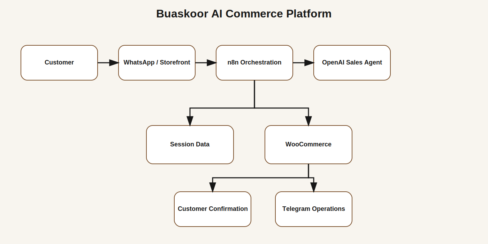
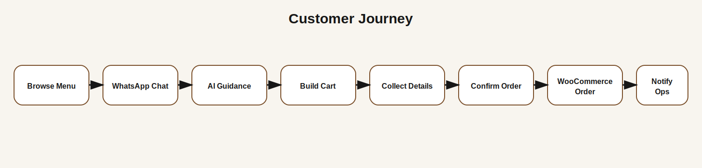
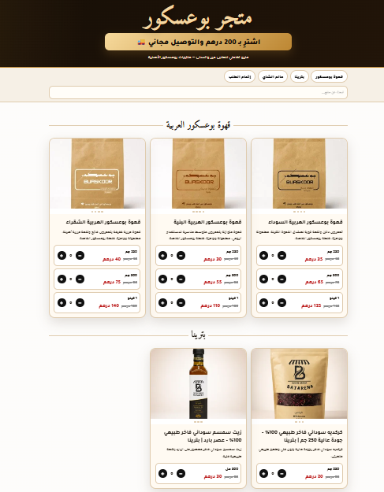
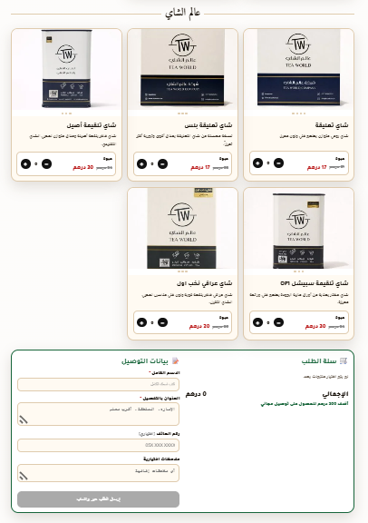
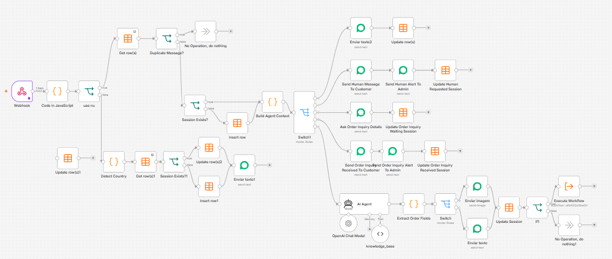
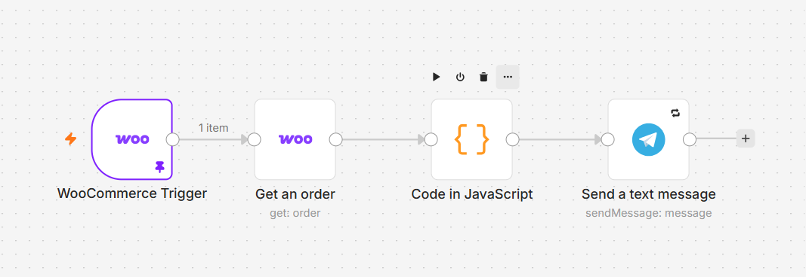
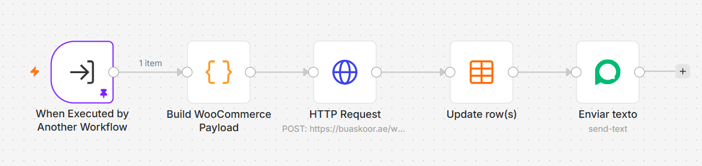
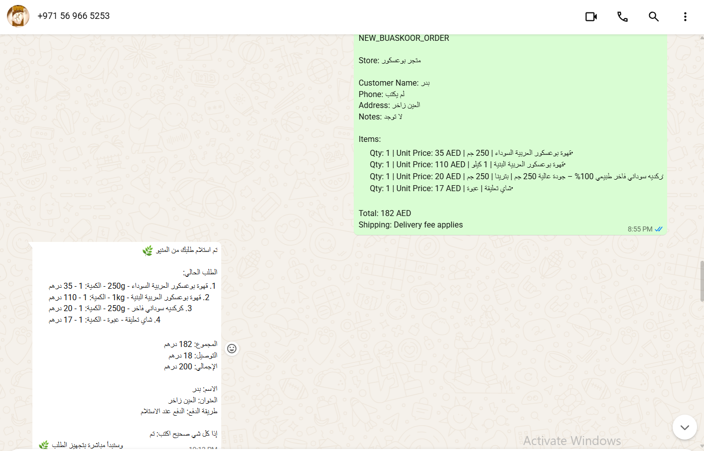
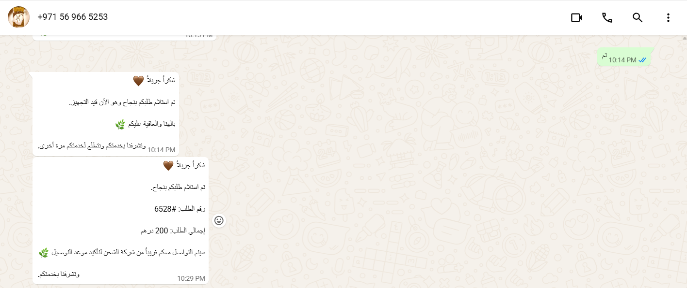

<div align="center">

# 🛒 Buaskoor AI Commerce Platform

### AI Sales Agent • Interactive Storefront • WooCommerce Automation • Operations Notifications

A functional e-commerce automation portfolio project built with **n8n, OpenAI, WhatsApp, WooCommerce, JavaScript, and Telegram**.

</div>

---

## Overview

This project demonstrates an AI-assisted commerce system developed for Buaskoor, a UAE-based coffee and specialty products store.

The platform connects an interactive product menu, a WhatsApp AI sales assistant, customer session management, WooCommerce order creation, and operational notifications.

> This repository contains a sanitized public portfolio version. Credentials, customer data, private infrastructure identifiers, and production secrets have been removed.

---

## Main Capabilities

| Area | Capability |
|---|---|
| Storefront | One-page interactive menu with WhatsApp ordering |
| AI sales | Arabic conversational sales assistant with product guidance |
| Product knowledge | Structured coffee, tea, hibiscus, and sesame oil catalog |
| Order parsing | Product, size, quantity, customer name, area, and address extraction |
| Cart management | Add, update, remove, and summarize cart items |
| Session management | Persistent customer journey and conversation context |
| Delivery rules | UAE shipping logic with special-area pricing |
| WooCommerce | Automated order creation through the REST API |
| Notifications | Telegram operations alerts for new orders |
| Support routing | Human handover and previous-order inquiries |
| Idempotency | Duplicate WhatsApp message detection |
| Country handling | UAE eligibility routing and unsupported-country responses |

---

## System Architecture



---

## Customer Journey



1. Customer opens the interactive product menu or starts a WhatsApp conversation.
2. The AI agent identifies intent and uses the product knowledge base.
3. The workflow stores session state and cart data.
4. Missing details are requested one step at a time.
5. Customer confirms the order.
6. n8n builds a WooCommerce order payload.
7. WooCommerce creates the order.
8. The customer receives confirmation.
9. The operations team receives a Telegram notification.

---

## Technology Stack

- **Automation:** n8n
- **AI:** OpenAI GPT models
- **Messaging:** WhatsApp through Evolution API
- **Commerce:** WordPress and WooCommerce REST API
- **Operations:** Telegram Bot API
- **Frontend:** HTML, CSS, JavaScript
- **Data:** n8n Data Tables and JSON session state
- **Integration:** Webhooks, REST APIs, workflow sub-processes

---

## Included Workflows

### AI Sales Agent

`workflows/buaskoor-ai-sales-agent-public.json`

Handles incoming WhatsApp messages, country routing, duplicate-message protection, session retrieval, human support, previous-order inquiries, AI product assistance, cart extraction, and order confirmation.

### WooCommerce Order Creation

`workflows/woocommerce-order-creation-public.json`

Handles product and variation mapping, shipping calculation, WooCommerce order payload generation, REST API order creation, customer confirmation, and session reset.

### WooCommerce Operations Notification

`workflows/woocommerce-order-notification-public.json`

Handles new-order triggers, order retrieval, customer and delivery formatting, and Telegram operations alerts.

---
# 📸 Screenshots

## 🏪 Store Front



---

## 🛒 Checkout Experience



---

## 🤖 AI Sales Agent Workflow



---

## 🛍️ WooCommerce Order Creation



---

## 📩 Telegram Notification Workflow



---

## 💬 Customer WhatsApp Journey

Customer receives automated order confirmation and completion messages.



---

## 🧑‍💼 Admin Order Notification

Automatic order notification sent to the store administrator.



## Repository Structure

```text
Buaskoor-AI-Commerce-Platform/
├── README.md
├── NOTICE.md
├── .gitignore
├── docs/
├── images/
├── screenshots/
├── storefront/
└── workflows/
```

---

## Project Status

**Functional prototype / portfolio case study**

The workflows represent a real commerce automation implementation. Production deployment should add stronger credential isolation, authenticated operations interfaces, monitoring, backups, and formal data-retention policies.

---

## Author

**Badreldin Mohamed Awad**  
AI Automation Engineer | E-Commerce Systems Specialist | n8n Workflow Architect  
Al Ain, UAE  
Email: [badrna3om@gmail.com](mailto:badrna3om@gmail.com)
